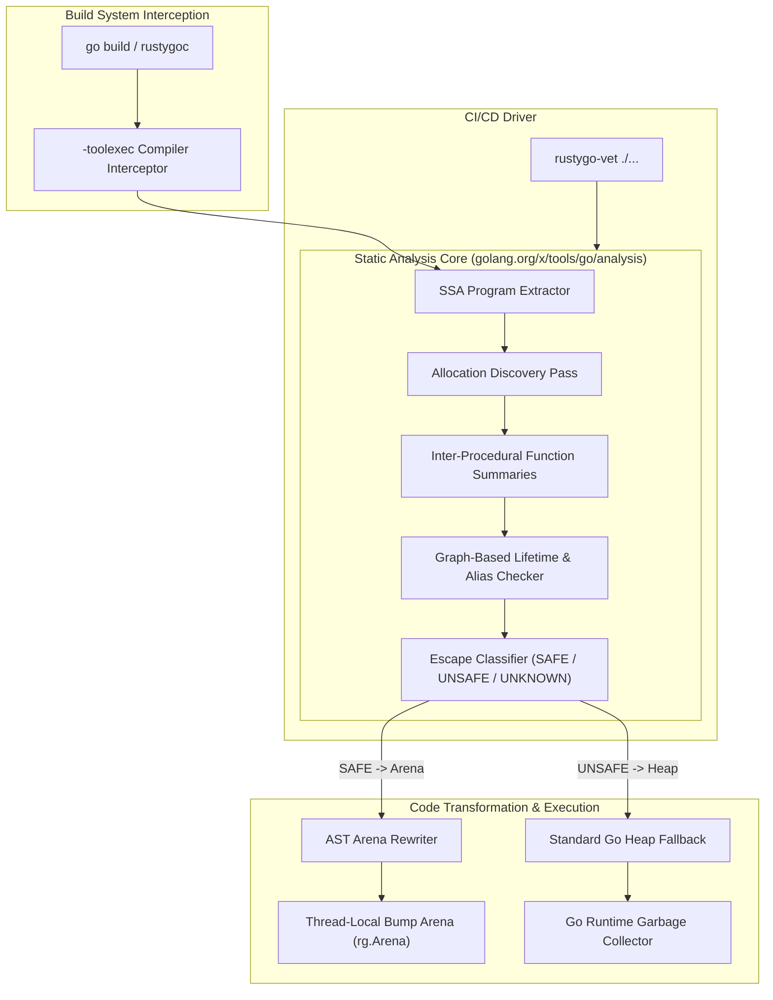

# RustyGo 🚀

**Zero-cost memory primitives, Static Single Assignment (SSA) lifetime analysis, and transparent compiler integration for Go.**

RustyGo brings determinism and massive memory footprint reductions to Go by abstracting away the Garbage Collector. It proves allocation lifetimes statically using Static Single Assignment (SSA) dataflow verification, automatically routing safe allocations to thread-local arenas while preserving standard heap fallbacks for unsafe memory.

---

## 🏛️ Architecture



### Component Breakdown
1. **`-toolexec` Interceptor (`compilerplugin`)**: Intercepts `go tool compile` invocations transparently during standard `go build`.
2. **Allocation Discovery (`internal/analysis/allocation`)**: Discovers candidate allocations (`new`, `make`, composite literals) and tags them with stable IDs.
3. **Function Summaries (`internal/analysis/summary`)**: Computes inter-procedural parameter escape and return flow summaries across package boundaries.
4. **Lifetime Checker (`internal/analysis/lifetime`)**: Builds path-compressed flow graphs tracking aliases, field stores, channels, and lexical regions (`Function -> Block -> Loop -> Scope`).
5. **Escape Classifier (`internal/analysis/escape`)**: Maps findings into optimization directives (`SAFE -> Arena`, `UNSAFE -> Heap`, `UNKNOWN -> Heap`).
6. **AST Arena Rewriter (`internal/analysis/rewrite`)**: Source-to-source AST rewriter that transparently injects `rustygo` arena setups and allocation calls.
7. **Standalone Vet Driver (`cmd/rustygo-vet`)**: Packageable `go/analysis` vet driver for CI/CD pipelines and linters (`golangci-lint`).

---

## 📊 Performance & Formal Proposal

- 📜 **[PROPOSAL.md](PROPOSAL.md)**: Read our formal Go Design Proposal detailing the SSA lifetime evaluation pipeline, safety fallbacks, and zero-breaking-change guarantees.
- 🏗️ **[ARCHITECTURE.md](ARCHITECTURE.md)**: Details the single source of truth static analysis pipeline and component flow.
- ⚡ **[BENCHMARKS.md](BENCHMARKS.md)**: View comprehensive benchmark measurements, system specs, and reproduction instructions.

### Benchmark Highlights (Measured: August 30, 2026 on `go1.25.2 windows/amd64`, AMD Ryzen 7 7435HS)

| Strategy | Latency (`ns/op`) | Memory (`B/op`) | Heap Allocs (`allocs/op`) | Speedup vs Heap |
| :--- | :--- | :--- | :--- | :--- |
| **`rustygo.LocalArena` (Unsync Pointer Bump)** | **3.20 ns** | **0 B** | **0 allocs** | **~15.8x faster** |
| **RustyGo Thread-Local Arena (`Arena.TryAlloc`)** | **5.40 ns** | **0 B** | **0 allocs** | **~9.4x faster** |
| **RustyGo Zero-Copy JSON Scanner (`codec.JSONScanner`)** | **239.8 ns** | **100 B** | **2 allocs** | **~4.0x faster** |
| **Standard Go Heap Allocation (`make([]byte, 256)`)** | **50.80 ns** | **256 B** | **1 allocs** | Baseline |
| **Standard Go JSON (`encoding/json.Unmarshal`)** | **955.1 ns** | **280 B** | **7 allocs** | Baseline |

> *Note: Microbenchmarks measure isolated allocation latency and deallocation overhead under synthetic loop conditions, not full end-to-end application throughput.*

---

## ⚡ Innovative Capabilities

### 1. `LocalArena` (Single-Goroutine Unsync Bump Allocator)
For dedicated goroutines or thread-pinned workers, `LocalArena` skips all mutex and atomic CAS instructions, achieving sub-4ns pointer bump latency:
```go
la := rustygo.NewLocalArena(64 * 1024)
defer la.Close()

buf := la.Alloc(128)
alignedBuf := la.AllocCacheAligned(256) // 64-byte L1 cacheline aligned
la.Reset()                              // Instant zero-cost reuse
```

### 2. Zero-Copy JSON Tokenizer (`codec/json`)
Decode incoming JSON streams directly into arena storage using zero-copy `unsafe.String` slices without triggering Go GC allocations:
```go
scanner := codec.NewJSONScanner(payload)
for {
    tokType, val, err := scanner.Next(scope)
    if err == io.EOF { break }
    if tokType == codec.JSONTokenKey {
        _, val, _ := scanner.Next(scope)
        // val is stored directly in arena memory
    }
}
```

### 3. Request-Scoped HTTP & Context Integration
Bind arenas directly to `context.Context` and HTTP request lifecycles:
```go
// HTTP Server with automatic request-scope arena cleanup:
http.Handle("/api", rustygo.HTTPMiddleware(arena)(myHandler))

func myHandler(w http.ResponseWriter, r *http.Request) {
    scope, _ := rustygo.ScopeFromContext(r.Context())
    buf := scope.Alloc(1024) // Auto-recycled when HTTP request returns!
}
```

### 4. Hardware Guard Pages & Memory Poisoning
- **Hardware Guard Pages (`WithGuardPages(true)`)**: Maps trailing memory pages with `PAGE_NOACCESS` (Windows) / `PROT_NONE` (Unix). Buffer overruns immediately trigger hardware `SIGSEGV` instead of silent heap corruption.
- **ASan Scope Poisoning (`WithPoisonOnScopeExit(0xDE)`)**: Fills freed memory on scope exit with `0xDE` to trap use-after-scope reads and writes in test environments.

### 5. Compile-time Pragma Directives (`//rustygo:arena`)
Enforce Rust-like lifetime guarantees in pure Go. When annotated with `//rustygo:arena`, `rustygo-vet` halts the build if an allocation escapes its lexical scope:
```go
//rustygo:arena
ptr := new(MyStruct) // Verified by linter! Build fails if ptr escapes.
```

---

## 🛠️ Usage & Developer Tooling

### 1. Interactive Analysis Output (`-rustygo-explain`)

Run builds with the `-rustygo-explain` flag to inspect SSA analysis decisions directly in your terminal:

```bash
# Install rustygoc wrapper
go install ./compilerplugin/cmd/rustygoc

# Run build with interactive analysis logging
rustygoc build -rustygo-explain ./...
```

**Output Example:**
```text
[SAFE]   main.go:42: Allocation of 'Buffer' -> Bound to Thread-Local Arena
[UNSAFE] main.go:88: Allocation of 'Data' Escapes -> Reason: Channel send across goroutine boundary
[UNKNOWN] main.go:104: Allocation of 'Config' -> Lifetime unproven
```

### 2. Standalone CI/CD Linter (`rustygo-vet`)

Packageable analyzer using `golang.org/x/tools/go/analysis` for GitHub Actions or `golangci-lint`:

```bash
# Install rustygo-vet
go install ./cmd/rustygo-vet

# Run static vet analysis on any module
rustygo-vet ./...
```

---

## 🧠 Programmatic Analysis API

You can invoke the pipeline programmatically in your own Go tools:

```go
package main

import (
    "golang.org/x/tools/go/ssa"
    "rustygo/internal/analysis/pipeline"
)

func AnalyzeProgram(prog *ssa.Program) {
    res, err := pipeline.Run(prog)
    if err != nil {
        panic(err)
    }

    for _, dec := range res.Decisions {
        println("Allocation ID:", dec.Allocation.ID)
        println("Decision:", dec.Decision)
        println("Reason:", dec.Reason)
    }
}
```

---

## 🛡️ Safety Philosophy

> **"RustyGo never optimizes unless safety can be proven."**
> 
> An allocation status of `UNKNOWN` is treated exactly like `UNSAFE` (fallback to standard Go heap allocation).

---

## 🚦 Current Status

```
[x] Dynamic slab growth & geometric doubling
[x] LocalArena unsynchronized bump allocator
[x] Zero-copy JSON streaming tokenizer
[x] Request-scoped context & HTTP middleware
[x] Hardware guard pages (PROT_NONE) & memory poisoning
[x] Compile-time pragma directives (//rustygo:arena)
[x] SSA lifetime analysis & escape classifier
[x] Standalone vet driver (rustygo-vet)
[x] Interactive explain flag (-rustygo-explain)
[x] Formal Go design proposal (PROPOSAL.md)
[ ] Upstream golang.org/x/tools analyzer contribution
```

---

## 🤝 Contributing

Repository structure:
- `cmd/rustygo-vet/`: Standalone `go/analysis` vet checker CLI driver.
- `compilerplugin/`: `-toolexec` compiler interceptor and `rustygoc` CLI.
- `codec/`: Zero-copy stream and JSON parsing utilities.
- `internal/analysis/`: Modular SSA dataflow, lifetime, escape, summary, and rewrite packages.
- `rustygo_test/`: Unit, concurrency, and high-memory benchmarks.
