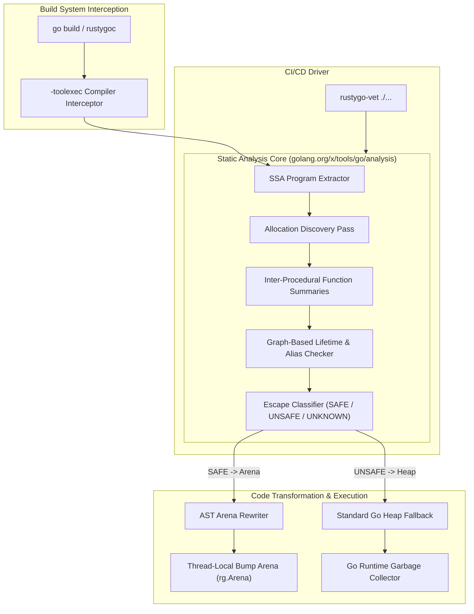

# RustyGo 🚀

**Zero-cost memory primitives, Static Single Assignment (SSA) lifetime analysis, and transparent compiler integration for Go.**

RustyGo brings determinism and massive memory footprint reductions to Go by abstracting away the Garbage Collector. It proves allocation lifetimes statically using Static Single Assignment (SSA) dataflow verification, automatically routing safe allocations to thread-local arenas while preserving standard heap fallbacks for unsafe memory.

---

## 🏛️ Architecture



### Component Breakdown
1. **`-toolexec` Interceptor (`compilerplugin`)**: Intercepts `go tool compile` invocations transparently during standard `go build`.
2. **Allocation Discovery (`internal/analysis/allocation`)**: Discovers candidate allocations (`new`, `make`, composite literals) and tags them with stable IDs.
3. **Function Summaries (`internal/analysis/summary`)**: Computes inter-procedural parameter escape and return flow summaries across package boundaries.
4. **Lifetime Checker (`internal/analysis/lifetime`)**: Builds path-compressed flow graphs tracking aliases, field stores, channels, and lexical regions (`Function -> Block -> Loop -> Scope`).
5. **Escape Classifier (`internal/analysis/escape`)**: Maps findings into optimization directives (`SAFE -> Arena`, `UNSAFE -> Heap`, `UNKNOWN -> Heap`).
6. **AST Arena Rewriter (`internal/analysis/rewrite`)**: Source-to-source AST rewriter that transparently injects `rustygo` arena setups and allocation calls.
7. **Standalone Vet Driver (`cmd/rustygo-vet`)**: Packageable `go/analysis` vet driver for CI/CD pipelines and linters (`golangci-lint`).

---

## 📊 Performance & Formal Proposal

- 📜 **[PROPOSAL.md](PROPOSAL.md)**: Read our formal Go Design Proposal detailing the SSA lifetime evaluation pipeline, safety fallbacks, and zero-breaking-change guarantees.
- 🏗️ **[ARCHITECTURE.md](ARCHITECTURE.md)**: Details the single source of truth static analysis pipeline and component flow.
- ⚡ **[BENCHMARKS.md](BENCHMARKS.md)**: View comprehensive benchmark measurements, system specs, and reproduction instructions.

### Benchmark Highlights (Measured: August 30, 2026 on `go1.25.2 windows/amd64`, AMD Ryzen 7 7435HS)

| Strategy | Latency (`ns/op`) | Memory (`B/op`) | Heap Allocs (`allocs/op`) | Speedup vs Heap |
| :--- | :--- | :--- | :--- | :--- |
| **RustyGo Thread-Local Arena (`Arena.TryAlloc`)** | **9.45 ns** | **0 B** | **0 allocs** | **~5.38x faster** |
| **Standard Heap Allocation (`make([]byte, 256)`)** | **50.80 ns** | **256 B** | **1 allocs** | Baseline |

> *Note: Microbenchmarks measure isolated allocation latency and deallocation overhead under synthetic loop conditions, not full end-to-end application throughput.*

---

## 🛠️ Usage & Developer Tooling

### 1. Interactive Analysis Output (`-rustygo-explain`)

Run builds with the `-rustygo-explain` flag to inspect SSA analysis decisions directly in your terminal:

```bash
# Install rustygoc wrapper
go install ./compilerplugin/cmd/rustygoc

# Run build with interactive analysis logging
rustygoc build -rustygo-explain ./...
```

**Output Example:**
```text
[SAFE]   main.go:42: Allocation of 'Buffer' -> Bound to Thread-Local Arena
[UNSAFE] main.go:88: Allocation of 'Data' Escapes -> Reason: Channel send across goroutine boundary
[UNKNOWN] main.go:104: Allocation of 'Config' -> Lifetime unproven
```

### 2. Standalone CI/CD Linter (`rustygo-vet`)

Packageable analyzer using `golang.org/x/tools/go/analysis` for GitHub Actions or `golangci-lint`:

```bash
# Install rustygo-vet
go install ./cmd/rustygo-vet

# Run static vet analysis on any module
rustygo-vet ./...
```

---

## 🧠 Programmatic Analysis API

You can invoke the pipeline programmatically in your own Go tools:

```go
package main

import (
    "golang.org/x/tools/go/ssa"
    "rustygo/internal/analysis/pipeline"
)

func AnalyzeProgram(prog *ssa.Program) {
    res, err := pipeline.Run(prog)
    if err != nil {
        panic(err)
    }

    for _, dec := range res.Decisions {
        println("Allocation ID:", dec.Allocation.ID)
        println("Decision:", dec.Decision)
        println("Reason:", dec.Reason)
    }
}
```

---

## 🛡️ Safety Philosophy

> **"RustyGo never optimizes unless safety can be proven."**
> 
> An allocation status of `UNKNOWN` is treated exactly like `UNSAFE` (fallback to standard Go heap allocation).

---

## 🚦 Current Status

```
[x] Arena allocator
[x] SSA analysis
[x] Lifetime checker
[x] Ownership analysis
[x] Allocation discovery
[x] Escape classification
[x] Function summaries
[x] Arena rewrite pass
[x] Standalone vet driver (rustygo-vet)
[x] Interactive explain flag (-rustygo-explain)
[x] Formal Go design proposal (PROPOSAL.md)
[ ] Upstream golang.org/x/tools analyzer contribution
```

---

## 🤝 Contributing

Repository structure:
- `cmd/rustygo-vet/`: Standalone `go/analysis` vet checker CLI driver.
- `compilerplugin/`: `-toolexec` compiler interceptor and `rustygoc` CLI.
- `internal/analysis/`: Modular SSA dataflow, lifetime, escape, summary, and rewrite packages.
- `rustygo_test/`: WASM and high-memory performance test benchmarks.
