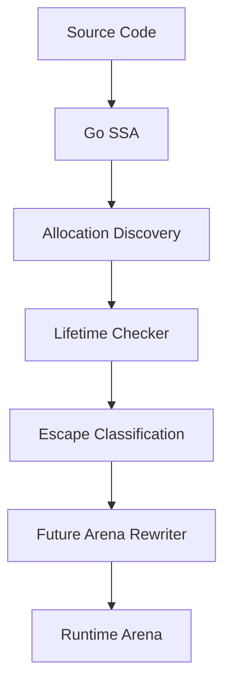

# RustyGo

RustyGo is a high-performance Go memory optimization framework that enables safe arena allocation by proving that allocations do not outlive their owning scope. It integrates with Go's build system to abstract away Garbage Collection latency and overhead.

## Architecture

The following diagram illustrates the RustyGo analysis and compilation pipeline:



### Component Breakdown
1. **Source Code**: The developer's input files.
2. **Go SSA**: Static Single Assignment representation generated via `golang.org/x/tools/go/ssa`.
3. **Allocation Discovery**: Discovers memory allocation candidates (`new`, `make`, literals) and tags them with stable IDs.
4. **Lifetime Checker**: Analyzes dominance frontiers, lexical blocks, ownership, and aliases to build path-compressed flow graphs.
5. **Escape Classification**: Converts lifetime states (SAFE, UNSAFE, UNKNOWN) into optimization decisions (Heap, Arena, Unknown).
6. **Future Arena Rewriter**: Source-to-source AST rewriter that will transparently replace eligible allocations with arena lookups.
7. **Runtime Arena**: High-performance bump allocator library backing optimized variables.

---

## Analysis Pipeline

### 1. SSA Extraction
Type-checked syntax nodes are converted into Static Single Assignment form, eliminating variable shadowing and rendering dataflow paths explicit.

### 2. Allocation Discovery
Examines instruction sets in SSA blocks to identify candidate allocations:
```go
// Discovered as ssa.Alloc candidate
x := new(User)
```

### 3. Lifetime Proof
Walks the lifetime graph to track aliases and trace uses recursively:
```go
func f() {
    x := new(User) // Proven SAFE (does not escape scope)
    _ = x.Name
}
```

### 4. Escape Classification
Maps findings into compiler directives:
- **SAFE** -> `Arena`
- **UNSAFE** -> `Heap`
- **UNKNOWN** -> `Unknown`

---

## Lifetime Safety Model

RustyGo implements a strict safety verification model based on lexical lifetimes, ownership, and aliases:
- **Lexical Regions**: Scopes nested hierachically (Function -> Block -> Loop -> If -> Scope).
- **Ownership Graph**: Ensures every memory location has exactly one owner value. Aliases propagate ownership without duplicating objects.
- **Escape Rules**: Pointers stored in globals, returned to callers, captured by closures, sent to channels, or passed to external C/reflection boundaries trigger escape violations.

---

## Current Status

```
[x] Arena allocator
[x] SSA analysis
[x] Lifetime checker
[x] Ownership analysis
[x] Allocation discovery
[x] Escape classification
[ ] Function summaries
[ ] Arena rewrite pass
[ ] Compiler integration
```

---

## Developer Usage

You can invoke the pipeline APIs directly:

```go
import (
    "golang.org/x/tools/go/ssa"
    "rustygo/internal/analysis/pipeline"
)

func run(prog *ssa.Program) {
    res, err := pipeline.Run(prog)
    if err != nil {
        panic(err)
    }

    for _, dec := range res.Decisions {
        println("Allocation ID:", dec.Allocation.ID)
        println("Decision:", dec.Decision)
    }
}
```

---

## Safety Philosophy

> **"RustyGo never optimizes unless safety can be proven."**
> 
> An status of `UNKNOWN` is treated exactly like `UNSAFE` (fallback to Heap).

---

## Testing

The project maintains:
- Exhaustive unit tests under `/internal/analysis/...`
- Integration tests validating control loops, channels, reflection, and unsafe memory boundaries.
- Benchmarks measuring memory utilization under high-field WASM operations.

---

## Contributing

The repository is structured as follows:
- `analyzer/`: Compiler plugin entrypoint and AST rewriter.
- `compilerplugin/`: `-toolexec` compile interceptor.
- `internal/analysis/`: Core SSA flow checker packages.
